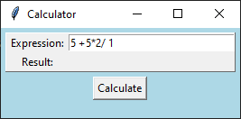
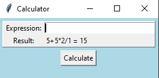

## GUI application
Calculates mathematical expression entered by the user.
The app takes into account extra spaces and the priority of mathematical operations.
#### Step 1. User input of an expression

#### Step 2. Show the result of the calculation
